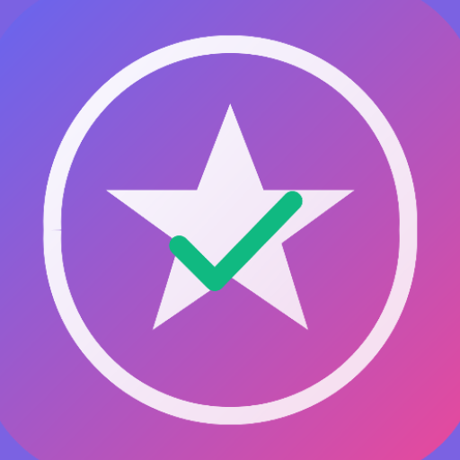

# Motívame · Tu Compañero de Motivación Diaria

<p align="center">
  
</p>

<p align="center">
  <a href="https://github.com/manalejandro/motivame/releases"></a>
  
  
  
  
</p>

> **Motívame** es una app Android de código abierto que te ayuda a mantener la motivación en tus hábitos y tareas pendientes. Define tus metas, elige con qué frecuencia quieres que te recuerde y deja que la app haga el resto.

---

## 📥 Descarga

👉 [github.com/manalejandro/motivame](https://github.com/manalejandro/motivame)

---

## ✨ Características

| Función | Descripción |
|---|---|
| 📝 **Gestión de tareas** | Crea, edita (pulsación larga) y elimina tareas |
| 🎯 **Metas por tarea** | Asocia múltiples objetivos a cada tarea |
| ⏯️ **Pausa / Reanudar** | Desactiva temporalmente una tarea sin borrarla |
| 🔔 **Avisos personalizables** | Elige cuántos avisos al día (1–10) y cada cuántos días se repite el ciclo |
| 🎲 **Horarios aleatorios** | Cada aviso se programa a una hora distinta dentro de la franja 9:00–21:00 |
| 🔊 **Sonido configurable** | Activa o desactiva el sonido de las notificaciones |
| 🌐 **Multiidioma** | 8 idiomas: Español · English · 中文 · Français · Deutsch · Português · 日本語 · 한국어 |
| 🎨 **Material Design 3** | Interfaz moderna con gradientes, colores vibrantes y soporte edge-to-edge |

---

## 📱 Capturas de pantalla

| Principal | Añadir tarea | Configuración |
|:---:|:---:|:---:|
| *(lista de tareas con resumen de avisos)* | *(formulario con metas y frecuencia)* | *(idioma, notificaciones, sonido)* |

---

## 🚀 Cómo funciona

1. **Crea una tarea** — ponle título y añade tus metas (el «por qué»).
2. **Configura la frecuencia** — número de avisos diarios y cada cuántos días se repite el ciclo.
3. **Recibe recordatorios** — la app programa los avisos a horas aleatorias distintas dentro de 9:00–21:00, distribuidos en días diferentes del ciclo para que no todos lleguen el mismo día.
4. **Pausa o edita** — mantén pulsada una tarea para editarla o usa el botón ⏸ para pausarla sin perder su configuración.

---

## 🏗️ Arquitectura y tecnología

```
MVVM · Jetpack Compose · WorkManager · DataStore · Kotlin Coroutines
```

### Estructura del proyecto

```
app/src/main/java/com/manalejandro/motivame/
├── data/
│   ├── Task.kt                   # Modelo de datos
│   └── TaskRepository.kt         # Persistencia con DataStore
├── notifications/
│   └── NotificationHelper.kt     # Envío de notificaciones (Ringtone independiente del canal)
├── ui/
│   ├── screens/
│   │   ├── MainScreen.kt         # Lista de tareas
│   │   ├── AddTaskScreen.kt      # Crear / editar tarea
│   │   └── SettingsScreen.kt     # Configuración (idioma, notificaciones, sonido)
│   ├── theme/
│   │   ├── Color.kt
│   │   ├── Theme.kt
│   │   └── Type.kt
│   └── viewmodel/
│       └── TaskViewModel.kt      # Estado y lógica de negocio
├── util/
│   └── LocaleHelper.kt           # Cambio de idioma en tiempo de ejecución
├── worker/
│   └── DailyReminderWorker.kt    # WorkManager: ejecuta recordatorios programados
├── MotivameApplication.kt        # Application: inicializa el canal de notificación
└── MainActivity.kt               # Actividad principal + navegación Compose
```

---

## 🌐 Idiomas soportados

| Código | Idioma |
|---|---|
| `es` | 🇪🇸 Español *(predeterminado)* |
| `en` | 🇬🇧 English |
| `zh` | 🇨🇳 中文 |
| `fr` | 🇫🇷 Français |
| `de` | 🇩🇪 Deutsch |
| `pt` | 🇵🇹 Português |
| `ja` | 🇯🇵 日本語 |
| `ko` | 🇰🇷 한국어 |

El idioma se selecciona desde **Configuración → Idioma** y se aplica instantáneamente sin necesidad de reiniciar el dispositivo.

---

## 🔔 Sistema de notificaciones

- **Franja horaria**: 9:00–21:00
- **Horas aleatorias únicas**: cada aviso del ciclo tiene una hora distinta a las demás
- **Distribución en días**: los avisos se reparten entre los días del ciclo para no coincidir todos el mismo día
- **Sonido independiente del canal**: el sonido se reproduce con `RingtoneManager` directamente, sin depender del estado interno del canal de Android — garantiza comportamiento consistente en todos los dispositivos y versiones
- **Canal único con `setSilent(true)`**: la notificación visual se envía siempre silenciosa a nivel de canal; el sonido se controla únicamente desde la preferencia del usuario

---

## 📦 Dependencias principales

| Librería | Versión |
|---|---|
| Kotlin | 2.0.21 |
| Jetpack Compose BOM | 2024.09.00 |
| Activity Compose | 1.8.0 |
| Lifecycle / ViewModel | 2.6.1 |
| WorkManager | 2.9.0 |
| DataStore Preferences | 1.0.0 |
| Material Icons Extended | 1.5.4 |
| Core KTX | 1.10.1 |

---

## 🔧 Requisitos

- **Android 7.0+** (API 24)
- **Target SDK**: 36
- **Gradle**: 9.0.1

---

## 🔐 Permisos

| Permiso | Motivo |
|---|---|
| `POST_NOTIFICATIONS` *(Android 13+)* | Mostrar recordatorios |
| `VIBRATE` | Vibración en las notificaciones |
| `RECEIVE_BOOT_COMPLETED` | Reprogramar avisos tras reinicio del dispositivo |

---

## 🛠️ Compilación

```bash
# Debug
./gradlew assembleDebug

# Release
./gradlew assembleRelease

# Instalar en dispositivo conectado
./gradlew installDebug

# Tests unitarios
./gradlew test
```

---

## 💡 Casos de uso

- **Estudiante** — Recordatorios de estudio con metas académicas concretas
- **Fitness** — Mantener rutina de ejercicio con objetivos de salud
- **Desarrollo personal** — Lectura, meditación, idiomas…
- **Productividad profesional** — Tareas con objetivos de carrera

---

## 🗺️ Roadmap

- [x] Gestión de tareas (crear, editar, eliminar, pausar)
- [x] Múltiples avisos por día con horas aleatorias
- [x] Ciclo de días configurable
- [x] Multiidioma (8 idiomas)
- [x] Sonido configurable independiente del canal Android
- [ ] Estadísticas de cumplimiento
- [ ] Widget de pantalla de inicio
- [ ] Backup en la nube
- [ ] Temas personalizables (claro / oscuro / AMOLED)
- [ ] Recordatorios con imagen motivacional

---

## 👨‍💻 Autor

Desarrollado por **[manalejandro.com](https://manalejandro.com)**

---

## 📄 Licencia

Este proyecto está disponible bajo la licencia **MIT**.  
Puedes usarlo, modificarlo y distribuirlo libremente citando al autor.

---

<p align="center"><strong>¡Mantente motivado y alcanza tus metas! 🚀</strong></p>
